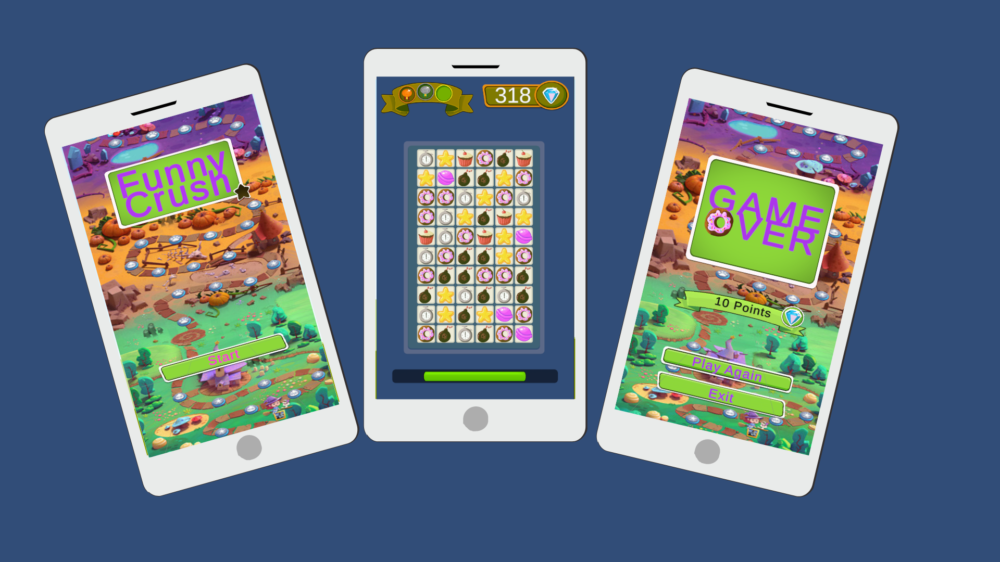

# 📝 FunnyCrash

## Descripción
**FunnyCrash** es un juego movil 2D construido con Unity y C#.

- immagen de inicio
- imagen del juego
- imagen de game over

El objetivo del juego es buscar dulces del mismo tipo y alinearlos para obtener puntos. Obtener puntos te permite además, 



## Requisitos Previos
Antes de comenzar, asegúrate de tener instalado lo siguiente:
- [Node.js](https://nodejs.org/): Para ejecutar la aplicación.
- Navegador web moderno.

## Instalación
Sigue estos pasos para instalar y ejecutar **eyCommercer**:

1. Clona el repositorio:

   ```bash
   git clone git@github.com:nahwish/EyCommerce.git
   
2. Navega al directorio del proyecto:

   ```bash
   cd shopi

3. Instala las dependencias generales:

   ```bash
   npm install

6. Levanta el servidor

   ```bash
   npm run dev


¡Listo! Ahora podés utilizar eyCommerce y simular una compra. en la terminal te va a decir en qué localhost abrir la página,
deberia verse algo asi : **http://localhost:5173/**


Contacto
Si tenés preguntas o comentarios, no dudes en ponerte en contacto con nosotros en [nadaro@outlook.com].# eyCommerce
