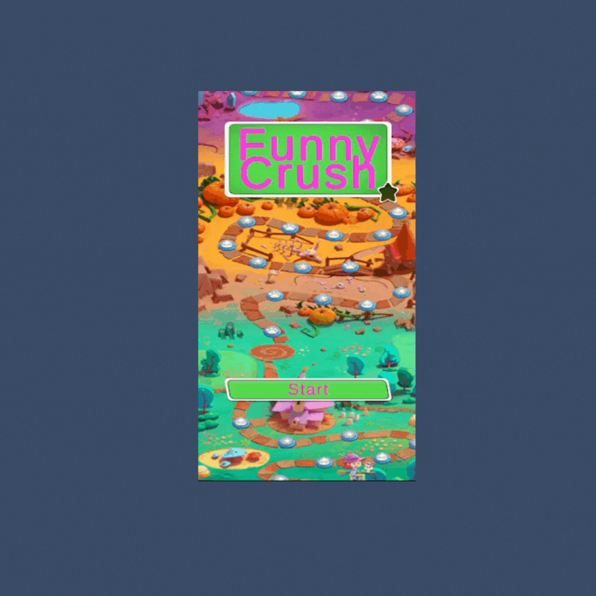
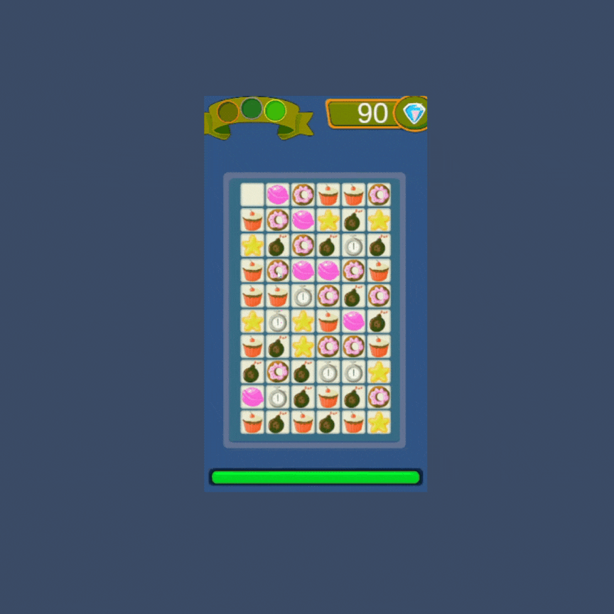
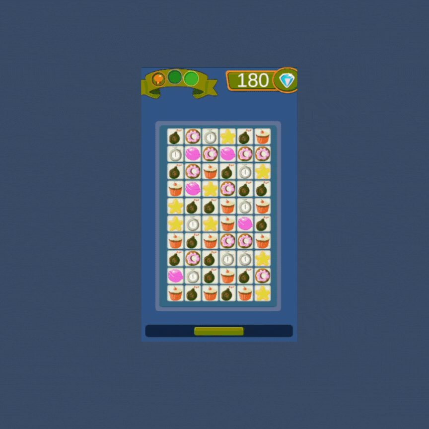

# FunnyCrash 🕹️

## Descripción

**FunnyCrash** es un juego movil 2D construido con Unity y C#.
El propósito del juego consiste en encontrar dulces del mismo tipo y alinearlos para acumular puntos. Cada vez que obtienes puntos, se añaden segundos adicionales a la cuenta regresiva. El desafío radica en evitar que la cuenta regresiva llegue a cero.


<hr/>

<p align="center">
Pantalla de inicio
</p>

<p align="center">
 
</p>

<hr/>

<p align="center">
Gameplay
</p>

<p align="center">
 
</p>

<hr/>

<p align="center">
Pantalla game over
</p>

<p align="center">

</p>

<hr/>

## Cómo Ejecutar el Videojuego en Unity

¡Gracias por tu interés en el videojuego! A continuación, se te proporcionarán los pasos detallados para ejecutar el juego en Unity.

1.  *Descargar e Instalar Unity*

Si aún no has instalado Unity en tu sistema, sigue estos pasos:

- Dirígete a la página de descarga de [unity](https://unity.com/pricing#plans-student-and-hobbyist).
- Descarga e instala la versión de Unity recomendada para este proyecto.

2. *Clonar o Descargar el Repositorio*

Clona este repositorio o descárgalo como un archivo ZIP.

   ```
   git clone https://github.com/tu_usuario/tu-repositorio.git
   ```

3. *Abrir el Proyecto en Unity*

- Abre [unity HUB](https://unity.com/es/download) (si lo has instalado) o simplemente abre Unity.
- En la ventana de inicio de Unity, selecciona "Abrir Proyecto".
- Navega hasta la carpeta donde clonaste o descargaste el repositorio y selecciona la carpeta del proyecto.

4. *Explorar y Configurar el Proyecto*

Una vez que el proyecto esté abierto, asegúrate de que la escena principal esté cargada. Puedes encontrar las escenas en la carpeta Assets.
Revisa cualquier configuración específica del proyecto en la documentación o en el README si es necesario.

5. *Ejecutar el Juego*

- Asegúrate de que la escena principal esté seleccionada.
- Haz clic en el botón "Play" en la parte superior de la interfaz de Unity.
- ¡Disfruta del juego! La escena se ejecutará en el editor de Unity.

6. *Compilar y Construir el Juego (Opcional)*

Si deseas construir el juego para ejecutarlo fuera de Unity, sigue estos pasos adicionales:

- En Unity, ve a "File" > "Build Settings".
- Selecciona la plataforma de destino (por ejemplo, PC, Mac, Linux).
- Haz clic en "Build" y selecciona una ubicación para guardar el archivo ejecutable.

¡Eso es todo! Ahora deberías poder disfrutar del videojuego directamente desde el entorno de desarrollo de Unity. Si tienes algún problema o pregunta, consulta la sección de problemas comunes en el README o ponte en contacto con nosotros.


*Contacto*
Si tenés preguntas o comentarios, no dudes en ponerte en contacto con Nahuel en [nahudaro@gmail.com].
